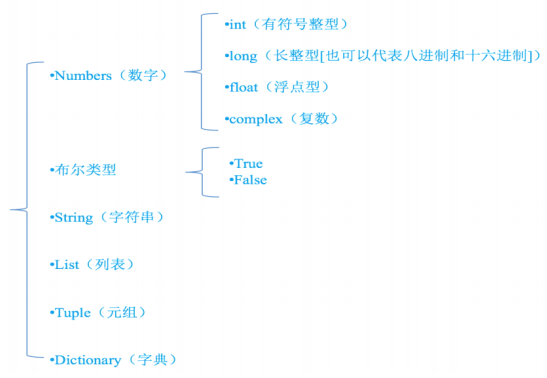
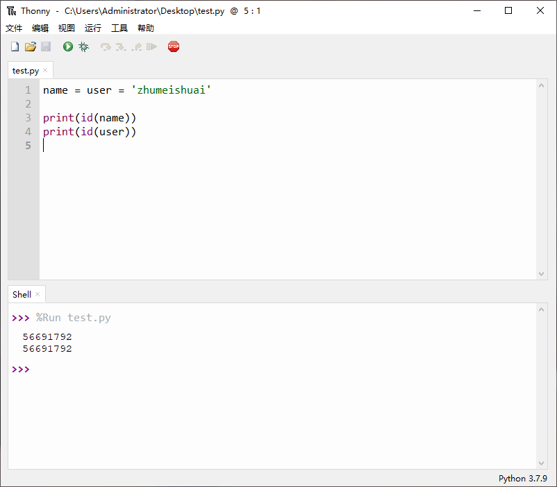
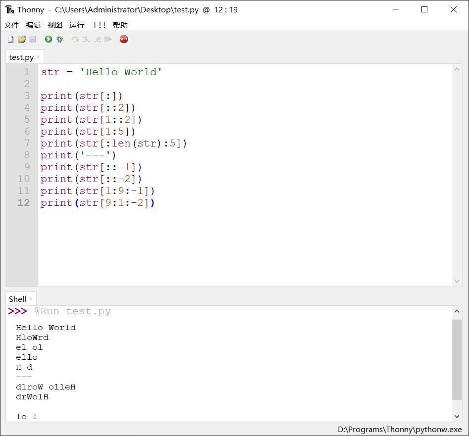

## 2.1 Python 变量的使用

### 2.1.1 变量及类型

#### 2.1.1.1 变量的定义

```python
# 程序是用来处理数据的，而变量是用来存储数据的
```

#### 2.1.1.2 变量的类型

 

```python
# 在 Python 中，只要定义了一个变量，而且它有数据，那么它的类型就已经确定了，系统会自动辨别
```

```python
# type 函数
语法： type(变量名)
作用： 查看变量的类型
```

```shell
Name = 'zhums'
Age = 20
ShenGao = 1.70
print (type(Name),type(Age),type(ShenGao))

>>>
<class 'str'> <class 'int'> <class 'float'>
```

### 2.1.2 标识符和关键字

#### 2.1.2.1 标识符

```python
# 标识符是自己定义的，就是开发人员在程序中自定义的一些符号和名称，如变量名、函数名
```

#### 2.1.2.2 标识符命名规则

```python
# 标识符由字母、下划线和数字组成，且不能以数字开头，Python 中的标识符是区分大小写的
```

#### 2.1.2.3 命名规则和方法

```mysql
# 见名知意：
	起一个有意义的名字，尽量做到看一眼就知道是什么意思，例如：name
# 小驼峰命名法：
	第一个单词以小写字母开始，第二个单词的首字母大小，例如：myName
# 大驼峰命名法
	每一个单词的首字母都采用大写字母，例如：FirstName
# 下划线命名
	使用下划线链接所有单词，Python 中推荐使用下划线链接所有单词，例如：send_buf
```

```python
# 注意：一定要注意关键字命名
查看关键字：
	import keyword
	keyword.kwlist
```

#### 2.1.2.4 变量的赋值

```python
# 传统赋值
name = "xuegod"
```

```python
# 链式赋值
name = user = "xuegod"
```

```python
# 序列解包赋值
name,age = "xueogd" , 10
注意：两边变量和常量要对等
```

```python
Name = 'zhums'
Age = Sr = 20
Sex,Zy = 'Man','Compute'
print(Name)
print(Age,Sr)
print(Sex,Zy)

>>> %Run -c $EDITOR_CONTENT
zhums
20 20
Man Compute
```

### 2.1.3 Python 虚拟机 < 面试题 >

#### 2.1.3.1 垃圾回收机制

```python
# 当一个常量被生成，会占用一份内存，这时如果有变量指向这个常量，那么该常量的引用计数+1，Python 虚拟机规定，当一个常量的引用计数为 0 时，也就是没有变量指向的时候，该常量占用的内存会被回收
```

```python
# id 函数
语法： id (变量名) 
作用：查看变量的 ID
```

 

```python
# del 函数
语法： del(变量名)
作用： 删除指针
```

#### 2.1.3.2 Python 是强类型的动态脚本语言

```python
# 强类型：
	不允许不同类型相加。例如：整形+字符串 会报类型错误。
# 静态：
	不使用显示数据类型声明，在变量赋值的时候就确定了这个变量的类型
# 脚本语言：
	一般是解释性语言，运行代码只需要一个解释器，不需要编辑。 
```

## 2.2 Python 输入、输出

### 2.2.1 Print 输出

```python
# print 函数
语法： print()
作用： 输出
```

### 2.2.2 Input 输入

`input()` 是 Python 的内置函数，用于从控制台读取用户输入的内容。`input()` 函数总是以字符串的形式来处理用户输入的内容，所以用户输入的内容可以包含任何字符。

```python
Str_Var = input('tipmsg')
Str_Var		# 字符串类型的变量，input 会将读取到的字符串放入 str 中。
tipmsg		# 提示信息。
```

## 2.3 Python 数字类型

### 2.3.1 Python 数字类型介绍

```python
整形 < int >
	1 为整形
浮点型 < float >
	1.1 为浮点型
长整形 < long >
	1L 为长整形，即在数字后面加 L 就是长整形
```

### 2.3.2 Python 数字类型转换

```python
# 通过运算改变数字类型
```

```python
print(3//2)
print(3/2)
print(type(3//2))
print(type(3/2))

>>>
1
1.5
<class 'int'>
<class 'float'>
```

### 2.3.3 Python 数字类型运算符

| 运算符 | 描述     |
| ------ | -------- |
| +      | 相加取和 |
| -      | 相减取差 |
| *      | 相乘取积 |
| /      | 相除取商 |
| //     | 取整除   |
| %      | 取余     |
| **     | 幂       |

```python
num1 = 5
num2 = 2
print (num1 + num2)
print (num1 - num2)
print (num1 * num2)
print (num1 / num2)
print (num1 // num2)
print (num1 % num2)
print (num1 ** num2)

>>>
7
3
10
2.5
2
1
25
```

```python
# Python 内建函数
```

```python
# abs 函数
语法： abs(变量)
作用： 取绝对值
```

```python
# round 函数
语法： round(NUM,ndigits=0)
作用： 对数值进行'四舍五入'，'ndigits' 是小数向右取整的位数，负数表示向左取整
```

```python
# pow 函数
语法： pow(x,y[z])
作用： 相当于 x ** y 或 x ** y % z
```

```python
# help 函数
语法： help([函数名或对象名])
作用： 查看函数或对象的帮助
```

```shell
Num1 = -10
Num2 = 10/3
print(abs(Num1))
print(Num2,round(Num2,ndigits=1))
print(pow(5,2),pow(5,2,4))

>>>
10
3.3333333333333335 3.3
25 1
```

## 2.4 Python 字符串类型

### 2.4.1 Python 字符串类型概述

```python
# 字符串：字符串是一个有序的，不可修改的，以引号包围的序列
# Python 字符串：双引号或单引号中的数据，就是字符串
```

```python
# 引号：
    单引号	''
    双引号 ""
    三单引号 '''  < 多用于代码的注释 >
    三双引号 """  < 多用于代码的注释 >
```

```python
# 单引号和双引号的区别
    都是字符串的标准格式，只是为了区分英语中的一些语义
# 三引号
	字符串的内容可换行，多用于注释
```

```shell
Name1 = 'zhums'
Name2 = "wuyi"
print(type(Name1),type(Name2))
'''
注释
'''
"""
注释
"""

>>>
<class 'str'> <class 'str'>
```

```python
# 字符串存储的另一种方式
a = 'zhums '
b = 'love '
c = 'wuyi'
d = a + b + c
print(d)

>>>
zhums love wuyi
```

```python
# 字符串中的特殊字符

\			# 转义符
\在行尾时	 # 续行符
\\			# 反斜杠符号
\'			# 单引号
\"			# 双引号
\a			# 响铃
\b			# 退格
\000		# 空
\n			# 换行
\v			# 纵向制表符
\t			# 横向制表符
\r			# 回车
\f			# 换页
```

```python
# 占位符

%s		# 字符串占位符
%d		# 数字占位符
%f		# 浮点数占位符
%.2f	# 空值浮点数数字占位符
```

```python
a = 'zhums'
b = 'wuyi'
c = 10
print("%s %s %s"%(a,b,c))

>>>
zhums wuyi 10
```

### 2.4.2 Python 字符串的索引

```python
# 在 Python 中所有有序的序列都有索引的概念，它们的区别就在于序列是否可以被修改；
# 字符串中每一个个体都被称作字符也是该字符串的一个元素，每个元素对应一个索引值
# 索引的使用：取单个字符时，使用'字符串[索引号]'
```

```python
# len 函数
语法： len()
作用： 查看一个序列的长度
```

```python
# 字符串截取：包头不包尾
语法： 字符串[start:end:step]
start	# 默认值为 0
end		# 默认值为字符串结束元素
step	# 默认值为 1
若 step > 0, 则表示从左向右切片。此时，start 必须小于 end 才有结果，否则为空。 
若 step < 0, 则表示从右到左切片。此时，start 必须大于 end 才有结果，否则为空。
```



### 2.4.3 Python 字符串的方法

#### 2.4.3.1 字符串计数

```python
count()		# 统计出现的次数
'''
语法：变量.count(sub_str,start,end)
sub_str: 查找的内容，类型 str
start: 开始位置，默认 0
end: 结束位置， 默认 len()
'''
```

```python
# DEMO:

str = 'Hello World'
print(str.count('o',4,8))

>>>
2
```

#### 2.4.3.2 字符串查找

```python
find() & rfind()	# 查找字符串
'''
语法：变量.find(sub_str,start,end)
sub_str: 查找的内容，类型 str
start: 开始位置，默认 0
end: 结束位置， 默认 len()
返回值: 如果找到 sub_str 返回 sub_str 在字符串中的位置的正数下标，如果没有找到返回 -1
'''
# rfind()即从右向左查找
```

```python
index() & rindex()	# 查找字符串
'''
语法：变量.index(sub_str,start,end)
sub_str: 查找的内容，类型 str
start: 开始位置，默认 0
end: 结束位置， 默认 len()
返回值: 如果找到 sub_str 返回 sub_str 在字符串中的位置的正数下标，如果没有找到报错
'''
# rindex()即从右向左查找
```

```python
# DEMO：

str = 'Hello World'
print(str.find('o'))
print(str.rfind('o'))
print(str.index('o'))
print(str.rindex('o'))

>>>
4
7
4
7
```

#### 2.4.3.3 字符串分割

```python
partition & rpartition	# 字符串分割
'''
语法：变量.partition(str)
str：将变量以 str 分割成三部分
返回值：str 前，str，str 后
'''
# rpartition 即从右往左
```

```python
splitlines	# 字符串分割
'''
说明：按照行分割，即按照 \n 分割
语法：splitlines()
返回值：返回一个包含各行作为元素的列表
'''
```

```python
split	# 字符串分割
'''
说明：按照指定字符分割
语法：split(str)
返回值：返回一个包含各个元素的列表
'''
```

```python
# DEMO：

str = 'Hello World'
my_str = 'Hello\nWorld'
print(str.partition('o'))
print(str.rpartition('o'))
print(my_str.splitlines())
print(str.split('o'))

# 运行结果：
('Hell', 'o', ' World')
('Hello W', 'o', 'rld')
['Hello', 'World']
['Hell', ' W', 'rld']
```

#### 2.4.3.4 字符串替换

```python
replace		# 字符串替换
'''
说明：从左到右替换指定的元素
语法：replace(s_str,d_str,num)
s_str：源字符串
d_str：目标字符串
num：指定替换个数，默认全部替换
'''
```

```python
# DEMO：

str = 'Hello World'
print(str.replace('l','i'))
print(str.replace('l','i',1))

# 运行结果：
Heiio Worid
Heilo World
```

#### 2.4.3.5 字符串修饰

```python
center
'''
说明： 让字符串在指定的长度居中
语法： center(num,str)
num： 指定长度
str： 指定填充内容，默认以空格填充
'''
```

```python
# DEMO：

str = 'hl'
print(str.center(10,'-'))

# 运行结果：
----hl----
```

```python
ljust
'''
说明： 让字符串在指定的长度左对齐
语法： ljust(num,str)
num： 指定长度
str： 指定填充内容，默认以空格填充
'''
```

```python
# DEMO：

str = 'hl'
print(str.ljust(10,'-'))

# 运行结果：
hl--------
```

```python
rjust
'''
说明： 让字符串在指定的长度右对齐
语法： rjust(num,str)
num： 指定长度
str： 指定填充内容，默认以空格填充
'''
```

```python
# DEMO：

str = 'hl'
print(str.rjust(10,'-'))

# 运行结果：
--------hl
```

```python
zfill
'''
说明： 将字符串填充到指定长度，不足地方用 0 从左开始补充
语法： zfill(num)
num： 指定长度
'''
```

```python
# DEMO：

str = 'hl'
print(str.zfill(10))

# 运行结果：
00000000hl
```

```python
strip
'''
说明： 去除两边空格，可指定去除内容
语法： strip(str)
str： 指定去除的字符
'''
```

```python
rstrip
'''
说明： 去除右边空格，可指定去除内容
语法： strip(str)
str： 指定去除的字符
'''
```

```python
lstrip
'''
说明： 去除左边空格，可指定去除内容
语法： lstrip(str)
str： 指定去除的字符
'''
```

```python
# DEMO：

str = ' hl '
str2 = '--hl--'
print(str.strip())
print(str2.strip('-'))
print(str.rstrip())
print(str2.rstrip('-'))
print(str.lstrip())
print(str2.lstrip('-'))

# 运行结果：
hl
hl
 hl
--hl
hl 
hl--
```

```python
format
'''
说明： 按顺序，将后面的参数传递给前面的大括号
语法： format(参数1,参数2...)
'''
```

```python
# DEMO：

str = '{} is {}'
print(str.format('hl','god'))

# 运行结果：
hl is god
```

#### 2.4.3.6 字符串变形

```python
upper
'''
说明： 将字符串中所有字母转换为大写
语法： upper()
'''
```

```python
lower
'''
说明： 将字符串中所有字母转换为小写
语法： lower
'''
```

```python
swapcase
'''
说明： 将字符串中所有字母大小写互换
语法： swapcase()
'''
```

```python
title
'''
说明： 将字符串中单词首字母大写，单词以非字母划分
语法： title()
'''
```

```python
capitalize
'''
说明： 将字符串的首字母大写
语法： capitalize()
'''
```

```python
expandtabs
'''
说明： 将字符串中的制表符转换为空格，制表符默认空格数为 8 
语法： expandtabs(num)
'''
```

```python
# DEMO：

print('hello'.upper())
print('HELLO'.lower())
print('Hello'.swapcase())
print('hello world'.title())
print('hello world'.capitalize())
print('hl\tis\tcool'.expandtabs(10))

# 运行结果：
HELLO
hello
hELLO
Hello World
Hello world
hl        is        cool
```

#### 2.4.3.7 字符串判断

```python
isalnum
'''
说明： 判断字符串是否完全由字母戒数字组成
语法： isalnum()
'''
```

```python
isalpha
'''
说明： 判断字符串是否完全由字母组成
语法： isalpha()
'''
```

```python
isdigit
'''
说明： 判断字符串是否完全由数字组成
语法： isdigit()
'''
```

```python
isupper
'''
说明： 判断字符串当中的字母是否完全是大写
语法： isupper()
'''
```

```python
islower
'''
说明： 判断字符串当中的字母是否完全是小写
语法： islower()
'''
```

```python
istitle
'''
说明： 判断字符串是否满足 title 格式，即是否为单词首字母大写
语法： istitle()
'''
```

```python
isspace
'''
说明： 判断字符串是否完全由空格组成
语法： isspace()
'''
```

```python
startswith
'''
说明： 判断字符串的开头字符，也可以截取判断
语法： startswith(num)
'''
```

```python
endswith
'''
说明： 判断字符串的结尾字符，也可以截取判断
语法： endswith(num)
'''
```

```python
# DEMO：

print('123abc'.isalnum())
print('123abc'.isalpha())
print('123abc'.isdigit())
print('ABC'.isupper())
print('abc'.islower())
print('Hello World'.istitle())
print('a b c'.isspace())
print('abc'.startswith('a'))
print('abc'[1].startswith('b'))
print('abc'.endswith('a'))
print('abc'[2].endswith('c'))

# 运行结果：
True
False
False
True
True
True
False
True
True
False
True
```

### 2.4.4 Python 字符串的编码

| 编码方式         | ASCII    | Unicode                           | UTF-8                                  |
| ---------------- | -------- | --------------------------------- | -------------------------------------- |
| 二进制表示 'A'   | 01000001 | 00000000 01000001                 | 01000001                               |
| 二进制表示 '中'  |          | 01001110 00101101                 | 11100100 10111000 10101101             |
| 十六进制形式     |          | \u4e2d                            | b\xe4\xb8\xad                          |
| 编码范围         | 只有英文 | 所有语言                          | 所有语言                               |
| 一个字符占字节数 | 1        | 2 < 少数偏僻字 4 >                | 英文 1，中文 3 < 少数偏僻字 4-6 >      |
| 特点             |          | 统一，英文就在 ASCII 前补一个字节 | 节省，英文跟 ASCII一样只有 1 个字节    |
| 用处             |          | 内存中，服务器中，比较统一        | 保存在硬盘时，传输时需要，比较节省资源 |

```python
# Python 字符串是一种数据类型，但是字符串比较特殊，它有一个编码的问题。
	因为计算机只能处理数字，如果要处理文本，就必须先把文本转换为数字才能处理。最早的计算机在设计时采用 8 个比特（bit）作为一个字节（byte），所以，一个字节能表示的最大的整数就是 255（二进制 11111111=十进制 255），如果要表示更大的整数，就必须用更多的字节。比如两个字节可以表示的最大整数是 65535，4 个字节可以表示的最大整数是 4294967295。
	由于计算机是英语国家发明的，最早只有 127 个字母被编码到计算机里，也就是大小写英文字母、数字和一些符号，这个编码表被称为 ASCII 编码，比如大写字母 A 的编码是 65，小写字母 a 的编码是 97。
	但是要处理中文显然一个字节是不够的，至少需要两个字节，而且还不能和 ASCII 编码冲突，所以，中国制定了 GB2312 编码，用来把中文编进去。
	全世界有上百种语言，日本把日文编到 Shift_JIS 里，韩国把韩文编到 Euc-kr 里，各国有各国的标准， 就会不可避免地出现冲突，结果就是，在多语言混合的文本中，显示出来会有乱码。
	因此，俗称“万国码”的 Unicode 应运而生。Unicode 把所有语言都统一到一套编码里，这样就不会再有乱码问题了。
	Unicode 标准也在不断发展，但最常用的是用两个字节表示一个字符（如果要用到非常偏僻的字符，就需要 4 个字节）。现代操作系统和大多数编程语言都直接支持 Unicode。
	现在，捋一捋 ASCII 编码和 Unicode 编码的区别：ASCII 编码是 1 个字节，而 Unicode 编码通常是 2 个字节。
	字母 A 用 ASCII 编码是十进制的 65，二迚制的 01000001；
	字符 0 用 ASCII 编码是十进制的 48，二迚制的 00110000，注意字符'0'和整数 0 是不同的； 
	汉字中已经超出了 ASCII 编码的范围，用 Unicode 编码是十迚制的 20013，二进制的 01001110 00101101。
	如果把 ASCII 编码的 A 用 Unicode 编码，只需要在前面补 0 就可以，因此，A 的 Unicode 编码是 00000000 01000001。
	新的问题又出现了：如果统一成 Unicode 编码，乱码问题从此消失了。但是，如果你写的文本基本上全部是英文的话，用 Unicode 编码比 ASCII 编码需要多一倍的存储空间，在存储和传输上就十分不划算。所以，本着节约的精神，又出现了把 Unicode 编码转化为“可发长编码”的 UTF-8 编码。UTF-8 编码把一个 Unicode 字符根据不同的数字大小编码成 1-6 个字节，常用的英文字母被编码成 1 个字节，汉字通常是 3 个字节，只有很生僻的字符才会被编码成 4-6 个字节。如果你要传输的文本包含大量英文字符，用 UTF-8 编码就能节省空间：
	UTF-8 编码有一个额外的好处，就是 ASCII 编码实际上可以被看成是 UTF-8 编码的一部分，所以，大量只支持 ASCII 编码的历史遗留软件可以在 UTF-8 编码下继续工作。搞清楚了 ASCII、Unicode 和 UTF-8 的关系，我们就可以总结一下现在计算机系统通用的字符编码工作方式：
	在计算机内存中，统一使用 Unicode 编码，当需要保存到硬盘戒者需要传输的时候，就转换为 UTF-8 编码。用记事本编辑的时候，从文件读取的 UTF-8 字符被转换为 Unicode 字符到内存里，编辑完成后，保存的时候再把 Unicode 转换为 UTF-8 保存到文件。浏览网页的时候，服务器会把动态生成的 Unicode 内容转换为 UTF-8 再传输到浏览器。
	由于 python 的诞生比 Unicode 标准发布的时间还要早，所以最早的 Python 只支持 ASCII 编码，普通的字符串 'ABC' 在 Python 内部都是 ASCII 编码的。Python 提供了 ord() 和 chr() 函数，可以把字母和对应的数字相互转换， len() 函数可以查字符串的长度：
```

```python
encode()		# 编码
decode()		# 解码
```

```python
u = '学神'
str1 = u.encode('gbk')
str2 = u.encode('utf-8')
print(str1)
print(str2)
u1 = str1.decode('gbk')
u2 = str2.decode('utf-8')
print(u1)
print(u2)

# 运行结果：
b'\xd1\xa7\xc9\xf1'
b'\xe5\xad\xa6\xe7\xa5\x9e'
学神
学神
```

```python
# 解决 Python 中编码问题
由于 Python 源代码也是一个文本文件，所以，当你的源代码中包含中文的时候，在保存源代码时， 就需要务必指定保存为 UTF-8 编码。当 Python 解释器读取源代码时，为了让它按 UTF-8 编码读取，我们通常在文件开头写上这两行 < python3 默认为 utf-8 所以没必要加文档头 >
    1、# -*- coding: utf-8 -*-
    2、# coding=utf-8
```

## 2.5 作业

```python
# BMI指数(Body Mass Index) 以称身体质量指数
BMI值计算公式: BMI = 体重(公斤) / 身高的平方(米)
# 标准表:
    BMI < 18.5   # 体重过轻 
    18.5 <= BMI < 24 	# 体重正常 
    BMI > 24  	# 体重过重
# 要求: 输入身高的体重，打印出BMI的值并打印体重状况
```

```python
# 输入身高体重的值，打印出 BMI 的值并打印体重状况

ShenGao = float(input("Please Input ShenGao <单位：米>："))
TiZhong = int(input("Please Input TiZhong <单位：公斤>:"))
BMI = TiZhong/(ShenGao ** 2)
if BMI > 24:
    print('体重过重,BMI为：%f' %BMI)
elif BMI > 18.5:
    print('体重正常,BMI为：%f' %BMI)
else:
    print('体重过轻,BMI为：%f' %BMI)
    
# 执行结果：

Please Input ShenGao <单位：米>：1.7
Please Input TiZhong <单位：公斤>:45
体重过轻,BMI为：15.570934
```

 
