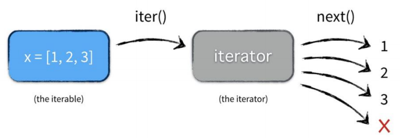
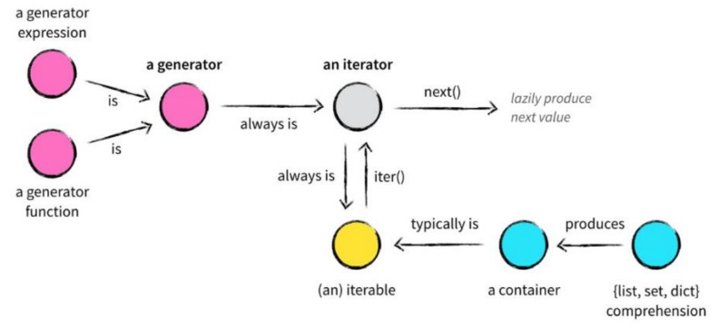
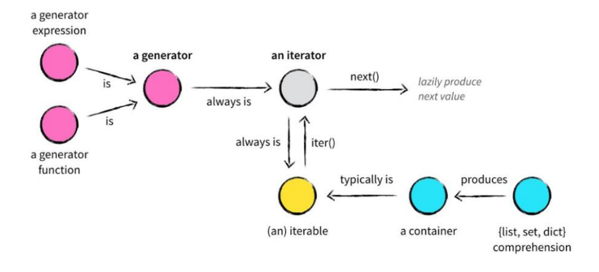

## 1.1 可迭代对象

```python
对 list、 tuple、 str 等类型的数据使用 for 循环，可以一次得到数据进行使用，我们把这样的过程称为遍历，也叫迭代
```

### 1.1.1 isinstance() 函数

```python
isinstance
'''
语法：isinstance(object,classinfo)
说明：判断参数 object 是不是 classinfo 的实例或是其子类，是则返回 True，否则返回 False
'''
Iterable 	# 迭代
```

```python
# DEMO：

from collections.abc import Iterable
print(isinstance('abc',Iterable))
print(isinstance([1,2,3],Iterable))
print(isinstance({1,2,3},Iterable))
print(isinstance({'name':'hl'},Iterable))
print(isinstance(1,Iterable))

# 执行结果：

True
True
True
True
False
```

### 1.1.2 for 循环的本质

```python
# 遍历的是可迭代对象：
for item in Iterable 循环的本质就是先通过 iter() 函数获取可迭代对象 Iterable 的迭代器，然后对获取到的迭代器不断调用 next() 方法来获取下一个值并将其赋值给 item 当遇到 StopIteration 的异常后循环结束
# 遍历的是迭代器：
for item in Iterator 循环的迭代器，不断调用 next()方法来获取下一个值并将其赋值给 item，当遇到 StopIteration 的异常后循环结束
```

## 1.2 迭代器

```python
迭代器是访问可迭代对象的工具
迭代器是指 iter(object) 函数返回的对象 < 实例 >
迭代器可以用 next(it) 函数获取可迭代对象的数据
```

```python
iter(iterable) 从可迭代对象中返回一个迭代器，iterable 必须是能提供一个迭代器的对象
next(iterator) 从迭代器 iterator 中获取下一个记录，如果无法获取下一条记录，则触发 StopIteration 异常
```



```python
迭代器只能向前取值，不会后退
迭代器不要求你实现准备好整个迭代过程中所有的元素。仅仅是在迭代至某个元素时才计算该元素，而在这之前或之后，元素可以不存在或被销毁。整个特点使得它特别适合用于遍历一些巨大的或无限的集合
```

```python
# 现有一个集合 s = {'唐僧','悟空','八戒','沙僧'} 使用 while 语句和迭代器遍历

L = iter(s)
n = 0
while n < len(s):
    print(next(L))
    n += 1
else:
    print('遍历结束')
    
# 执行结果：

悟空
唐僧    
八戒    
沙僧    
遍历结束
```

## 1.3 生成器

### 1.3.1 生成器介绍

```python
生成器是能够动态提供数据的对象,生成器对象也是可迭代对象(实例)，在这里可以认为生成器其实就是迭代器的一种。
```

```python
# 生成器有两种：
1、生成器函数
2、生成器表达式
```

```python
# 生成器函数的定义：
含有 yield 语句的函数时生成器函数，此函数被调用将返回一个生成器对象

# 生成器函数的调用将返回一个生成器对象,生成器对象是一个可迭代对象
```



```python
yield 语句
'''
语法：
	def func():
		yield 表达式
说明：
	yield 用于 def 函数中，目的是将此函数作用生成器函数使用
	yield 用来生成数据，供迭代器的 nexit(it) 函数使用
'''
```

```python
def my_yield():
    print("即将生成 2")
    yield 2
    print("即将生成 3")
    yield 3
    print("即将生成 5")
    yield 5
    print("即将生成 7")
    yield 7
    print("遍历结束")
a = my_yield()		# 绑定生成器对象
iter(a)		# 返回一个迭代器
print(next(a))	# 从迭代器获取一个数据
```

```python
# 生成器表达式
'''
语法：(表达式 for 变量 in 可迭代对象 [if 真值表达式])
说明：以推导式的形式创建一个新的生成器
'''
gen = (i ** 2 for i in range(1,5))
it = iter(gen)
print(next(it))
print(next(it))
print(next(it))
print(next(it))
print(next(it))
```

```python
# 已知有一个列表 L = [2,3,5,7]，用生成器表达式从此列表中拿到数据，生成列表中数据的平方

L = [2,3,5,7]
gen = (i ** 2 for i in L)
it = iter(gen)
print(next(it))
print(next(it))
print(next(it))
print(next(it))

# 执行结果：

4
9
25
49
```

### 1.3.2 迭代工具函数

```python
# 迭代工具函数的作用是生成一个个性化的可迭代对象
```



```python
zip
'''
语法： zip(iter1[,iter2][,...])
说明： 返回一个 zip 对象，此对象用于生成元组，此元组的个数由最小的可迭代对象决定
'''
```

```python
enumerate
'''
语法： enumerate(iterable[,start])
说明： 生成带索引的枚举对象，返回迭代类型为索引-值对 < index-value 对 >，默认索引从零开始，也可以用 start 指定
'''
```

```python
# DEMO：

numbers = [10086,10000,10010,9558] 
names = ['中国移动','中国电信','中国联通']
for i in zip(numbers,names):
    print(i)
for x,y in zip(numbers,names):
    print('%s客服电话是：%d'%(y,x))
    
# 执行结果：

(10086, '中国移动')
(10000, '中国电信')      
(10010, '中国联通')      
中国移动客服电话是：10086
中国电信客服电话是：10000
中国联通客服电话是：10010
```

```python
# zip 重写方法一 < 函数版 >
numbers = [10086,10000,10010,9558] 
names = ['中国移动','中国电信','中国联通']
def my_zip(iter1,iter2):
    it1=iter(iter1) # iter(numbers)
    it2=iter(iter2) # iter(names)
    try:
        while True:
            a = next(it1)   # 获取numbers一个数据
            b = next(it2)   # 获取names一个数据
            yield (a,b) # 生成a,b
    except:     # 遇到错误执行except内语句
        pass
for i in my_zip(numbers,names):  # i=(10086,'中国移动')
    print(i)
    
# 执行结果：

(10086, '中国移动')
(10000, '中国电信')
(10010, '中国联通')
```

```python
# zip 重写方法二 < 函数版 >

def my_zip(*args):
    all_list = []   # 定义一个空列表来承载数据
    for i in range(len(args)):  # 获取到每个元素，并添加到列表中
        all_list.append(args[i])
    sort_list = sorted(all_list,key=lambda x:len(x))    # 对列表进行排序，获取到最小的元素长度
    min_list_logth = len(sort_list[0])  # 最小的元素长度
        # 添加数据
    a_list = []     
    for a in range(min_list_logth):
        a = [args[j][a] for j in range(len(args))]
        a_list.append(a)
    print(a_list)
my_zip([1,2,3],[4,2],[1,3,4,5],[1,2,3,4,5,6])

# 执行结果：

[[1, 4, 1, 1], [2, 2, 3, 2]]
```

```python
# enumerate 示例：

names = ['中国移动','中国电信','中国联通']
for i in enumerate(names):
    print(i)
print('---------------')
for j in enumerate(names,5):
    print(j)
    
# 执行结果：

(0, '中国移动')
(1, '中国电信')
(2, '中国联通')
---------------
(5, '中国移动')
(6, '中国电信')
(7, '中国联通')
```

```python
# enumerate 重写

names = ['中国移动','中国电信','中国联通']
def my_enum(iterable,i=0):
    it = iter(iterable)
    i = i
    n = 0
    while n <len(iterable):
        a = next(it)
        yield (i,a)
        i += 1
        n += 1
print(list(my_enum(names,2)))

# 执行结果：

[(2, '中国移动'), (3, '中国电信'), (4, '中国联通')]
```
