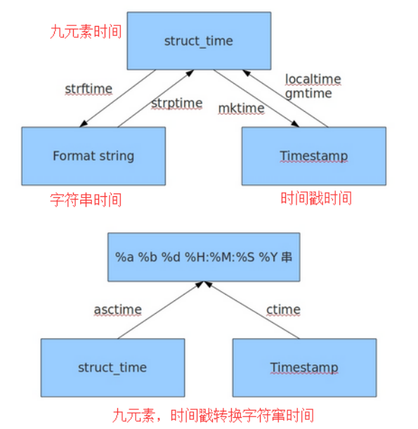

## 1.1 模块的概念

```python
# 模块介绍

模块是一个包含有一系列数据、函数、类等组成的程序组
模块是一个文件，模块文件名通常以 .py 结尾
```

```python
# 模块作用

让一些相关的数据、函数、类等有逻辑的组织在一起，使逻辑结构更清晰
模块中的数据、函数、类等可提供给其它模块或程序使用
```

```python
# 模块的分类

1、内建模块，在解析器内可以直接使用
2、标准库模块，安装 Python 时已安装且可以直接使用
3、第三方模块，需自己安装
4、用户自己编写的模块
```

```python
import
'''
语法： import 模块名1 [as 模块新名1],模块名2[as 模块新名2],...
说明： 导入模块
'''
```

```python
# mod.py

def mod(age):
    print('Hello World')
    print(age)

# test.py

import mod
mod.mod(18)

# 执行结果：

Hello World
18
```

## 1.2 模块导入原理

### 1.2.1 原理介绍

```python
1、模块导入会将要导入的文件执行一遍
2、导入模块的名称就是我们定义的脚本或包的名称
3、导入模块的过程：在指定范围内搜索指定名称对对应的 Python 脚本或包将其运行并获取其中的方法
```

### 1.2.2 模块搜索范围

```python
# 由 sys 模块的 sys.path 方法定义

import sys
print(sys.path)

# 因 sys.path 返回的数据类型是列表
1、列表可以修改、我们可通过修改 sys.path 获得暂时的修改
2、列表是有序的，当搜索过程中，在第一个路径下搜索到了，就停止搜索，因第一个路径是脚本的当前目录，所以禁止将脚本命名成模块的名称
3、Python 导入模块，被导入的脚本在第一次被导入之后会自动形成一个 .pyc 临时文件，之后，再次被导入时，实际上导入的是这个 .pyc 的临时文件
```

```python
reload
'''
语法：
说明：reload 函数使用模块名称，而不是变量名称，当你改变它的名称，它也是加载原来的名称。当使用 reload 时，这个模块会被重新编译，新的模块替换原来的模块。如果之前从这个模块创建的实例仍然使用旧的模块实现。特别是使用 from-import 语句加载的名称，也不会被更新。简单说：就是用于重新载入之前载入的模块
reload 会重新加载已加载的模块，但原来已经使用的方法还是会使用旧的模块，而新生产的方法会 使用新的模块；
reload 后还是用原来的内存地址；
reload 不支持 from ××× import ××× 格式的模块进行重新加载。
'''
```

## 1.3 import 导入方式

| 关键字                     | 对象      | 使用                     |
| -------------------------- | --------- | ------------------------ |
| import                     | 模块      | 模块.功能                |
| from 模块 import 功能      | 功能      | 功能                     |
| from 模块 import *         | 功能      | 功能                     |
| from 模块 import 功能,功能 | 功能      | 功能                     |
| as                         | 模块/功能 | 给导入的模块或功能起别名 |

```python
import mod
mod.mod(18)

from mod import mod
mod(20)

from mod import *
mod(19)

from mod import mod,mod2
mod(21)
mod2('zms')

import mod as age
from mod import mod2 as name
age.mod(20)
name('hl')
```

```python
注意： 在 Python2 中目录不可以直接导入，Python3 中可以；Python2 目录下有 _init_.py 文件才可以被导入，并且 _init_.py 导入后自动执行
```

## 1.4 简单的导入关系

### 1.4.1 导入模块的本质

```python
# 导入模块的本质就是把 Python 文件解释一遍
分析： import mod_name >> 要解释 mod_name.py >> 找到 mod_name.py 位置 >> 查找系统路径 sys.path
```

### 1.4.2 导入包的本质

```python
# 导入包的本质就是执行该包下的 _init_.py 文件
```

```python
# 在 py 文件中导入包下边的模块
```


## 1.5 关于 `if_name_=="_main_"`

## 1.5.1 本脚本

```python
在我们创建脚本之初，Python 会默认加载一些内建的变量，__name__ 就是其中一个,当我们脚本自己执行，也就是直接执行这个脚本的时候 __name__ 的值是 __main__
```

```python
def mod(age):
    print('Hello World')
    print(age)
print(__name__)

# 执行结果：
__main__
```

### 1.5.2 导入的模块

```python
# 如果导入执行脚本，该脚本的 __name__ 属性的值就是文件名本身

import os
print(os.__name__)

# 执行结果：

os
```

```python
# 判断是不是自己调用本身

def age(nl):
    print('age is %d'%nl)
if __name__ == '__main__':
    age(18)
```

### 1.5.3 Python 的相对导入

### 1.5.4 Python 有趣的导入

```python
import __hello__

# 执行结果：

Hello world
```

```python
# 经典 Python 之禅

import this

# 执行结果：

The Zen of Python, by Tim Peters

Beautiful is better than ugly.
Explicit is better than implicit.
Simple is better than complex.
Complex is better than complicated.
Flat is better than nested.
Sparse is better than dense.
Readability counts.
Special cases aren't special enough to break the rules.
Although practicality beats purity.
Errors should never pass silently.
Unless explicitly silenced.
In the face of ambiguity, refuse the temptation to guess.
There should be one-- and preferably only one --obvious way to do it.
Although that way may not be obvious at first unless you're Dutch.
Now is better than never.
Although never is often better than *right* now.
If the implementation is hard to explain, it's a bad idea.
If the implementation is easy to explain, it may be a good idea.
Namespaces are one honking great idea -- let's do more of those!

参考翻译：

优美胜于丑陋。 
显式胜于隐式。 
简单胜于复杂。 
复杂胜于难懂。 
扁平胜于嵌套。 
分散胜于密集。 
可读性应当被重视。
尽管实用性会打败纯粹性，特例也不能凌驾亍规则之上。 
除非明确地使其沉默，错误永远不应该默默地溜走。 
面对不明确的定义，拒绝猜测的诱惑。
用一种方法，最好只有一种方法来做一件事。
虽然一开始这种方法并不是显而易见的，但谁叫你不是 Python 之父呢。 
做比不做好，但立马去做有时还不如不做。
如果实现很难说明，那它是个坏想法。
如果实现容易解释，那它有可能是个好想法。
命名空间是个绝妙的想法，让我们多多地使用它们吧！
```

```python
# "反重力" 漫画

import antigravity
```

## 1.6 time 模块

### 1.6.1 Python 时间模块介绍

```python
时区： 时区是地球上的取余使用同一个时间定义
零时区：零时区: 7.5°W～7.5°E 时区中心线 0° ，它只是一个时区，就像北京的东 8 区。在这个时区里面的，就是格林威治标准时间。比如北京是今天早上 10 点，那么那里就是上午 2 点。
# UTC0 时区(中国东八区:上海)
闰秒：（戒称跳秒）是对协调世界时作出加一秒戒减一秒的调整，用来调整世界时间。 1998 年底调整过一次。61 秒(地球自转偏差导致的多出的 1 秒)
时间戳：时间戳是指格林威治时间 1970 年 01 月 01 日 00 时 00 分 00 秒(北京时间 1970 年 01 月 01 日 08 时 00 分 00 秒)起至现在的总秒数。通俗的讲，时间戳是一份能够表示一份数据在一个特定时间点已经存在的完整的可验证的数据
夏令时：夏令时日光时为了节省能源，每年夏天人工将时间调早一个小时。
	0：采用
    1：不采用
    -1：系统判断
```

### 1.6.2 时间的格式

```python
1. 字符串时间
2. 九元素时间
```

```python
1、年 	tm_year
2、月 	tm_mon
3、日 	tm_mday
4、时 	tm_hour
5、分 	tm_min
6、秒 	tm_sec1-61
7、一周的第几天 	tm_wday 0-6
8、一年的第几天 	tm_yday
9、是否夏令时 	 tm_isdst
    1: 启用
    0: 不启用 
    -1: 不知道
```

### 1.6.3 时间

```python
time.localtime		# 返回当前时区的九元素时间
time.gmtime			# 返回 0 时区的九元素时间
time.struct_time	# 返回一个九元素时间

time.asctime		# 将九元素时间转换成字符串格式 '周月日时分秒年'
time.ctime			# 将时间戳转换为字符串时间
time.strftime		# 定制指定格式字符串时间
	%y	# 两位年份
    %Y	# 四位年份
    %m	# 月份
    %d	# 日
    %H	# 小时 < 24时 >
    %I	# 小时 < 12时 >
    %M	# 分
    %S	# 秒
time.time			# 返回当前时间的时间戳
time.mktime			# 返回九元素时间的时间戳

time.clock			# 在 Linux 下记彔迚程运行时间，在 win 下记彔是距离上一次调用过了多久。第一次调用，返回的是迚程运行的实际时间。而第二次乊后的调用是自第一次调用以后到现在的运行时间 
time.sleep			# 让程序挂起指定秒
```



## 1.7 os 模块

```python
os.sep			# 返回当前系统的路径分隔符，windows 为 \，linux 为 /
os.name			# 返回系统类型。windows 为 nt，linux 为 posix 
os.getcwd		# 返回当前的工作目录
os.listdir		# 列出指定目录下的目录和文件
os.chdir		# 修改当前的工作目录
os.mkdir		# 创建目录
os.makedirs		# 递归创建目录
os.remove		# 删除文件
os.rmdir		# 删除文件夹
os.removedirs	# 递归删除文件夹
os.system		# 执行系统命令
os.popen		# 执行系统命令，将结果以文件的形式返回(命令，权限，缓存)
```

